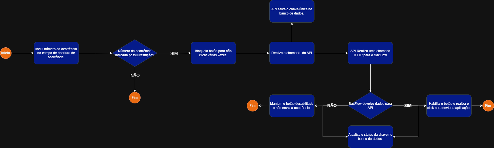
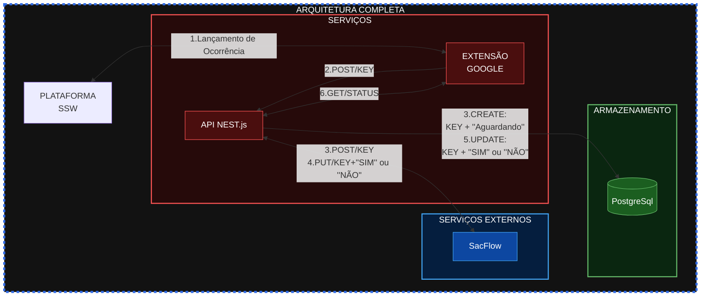

# Extensão google - Gerênciamento de ocorrências 

## Objetivos e Arquitetura do projeto
- ## Descrição do projeto
    Esse projeto tem como principal objetivo evitar o lançamento de ocorrências específicas indevidamente. Para isso, quando é realizada a abertura de uma ocorrência no SSW, essa ação acarreta em uma mensagem de confirmação para que o responsável faça a liberação (ou não) da abertura da ocorrência.
- ## Diagrama detalhado de ações

- ## Diagrama da Arquitetura Global

## **Extensão Google** - Ferramenta para controle de ocorrências SSW
- ### Descrição da aplicação
    Ferramenta do google para realizar, não só, alterações na página do SSW e bloqueio de envio de mensagem tamporário ou constânte, dependêndo da situação; mas também, realiza chamada HTTP para a API de comunicação com Banco de dados e SacFlow e aplicação de lógica de negócio.
- ### Ferramentas utilizadas e Pré-Requisitos Globais

## **API NEST.js** - Ferramenta chamadas de requisições/ações externas
- ### Descrição da aplicação
    Aplicação que realiza a comunicação com banco de dados para armanezar a situação do status da UniqueKey gerada para cada chamado específico, chamar o SacFlow para envio de mensagem e aplicação de lógica de negócio. 
- ### Ferramentas utilizadas e Pré-Requisitos Globais