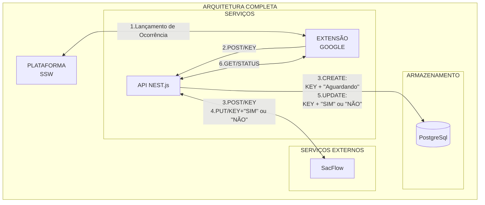

# Extensão google - Gerênciamento de ocorrências 

## Objetivos e Arquitetura do projeto
- ## Descrição do projeto
- ## Diagrama detalhado de ações

- ## Diagrama da Arquitetura Global

## **Extensão Google** - Ferramenta para controle de ocorrências SSW
- ### Descrição da aplicação
- ### Ferramentas utilizadas e Pré-Requisitos Globais

## **API NEST.js** - Ferramenta chamadas de requisições/ações externas
- ### Descrição da aplicação
- ### Ferramentas utilizadas e Pré-Requisitos Globais